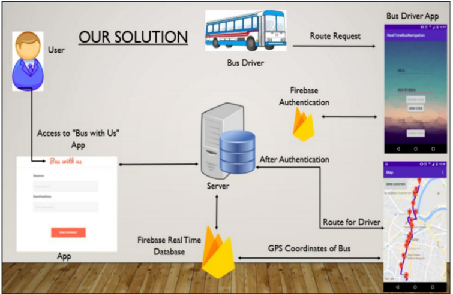

# RealTimeBusNavigation
A system developed to gather information like bus route and bus stops between source 	and destination entered by the user, track the real time position of buses around the user, filter from these buses and show the buses that are on user's entered path. This project consist of driver end android app, user end web app, firebase database and all connected to centralized node server.
  Prototype: 

